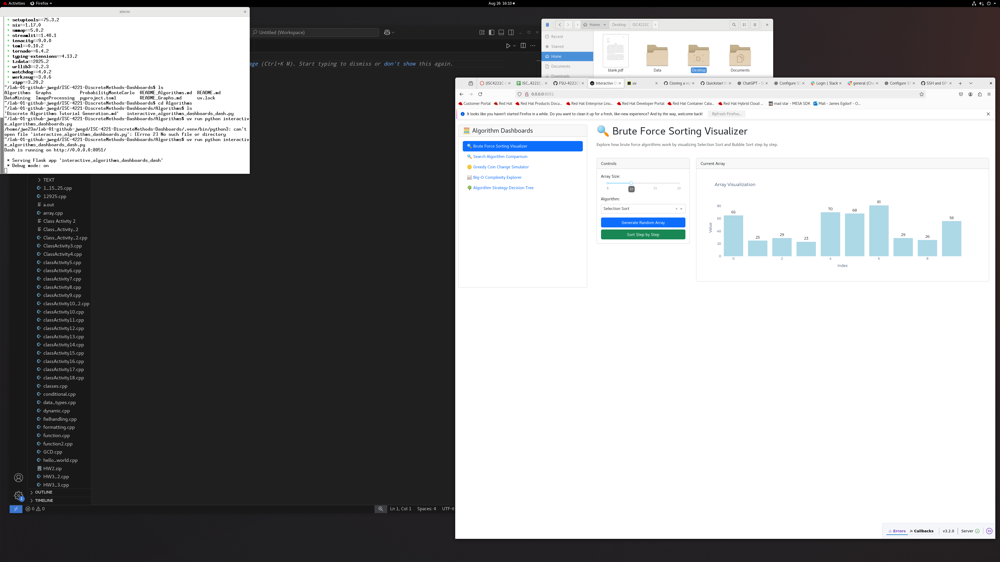

# Reflections
- I figured out how to configure an SSH key for github to more easily copy repositories on the linux system. Previous linux skills helped to set things up. I have configured an ssh key in the past but this method was different
- The concepts were attainable, however I would like to learn more about github and uv because while I felt like I could handle these instructions pretty well, I would like to become an expert.

## Algorithms Dashboard Screenshot

